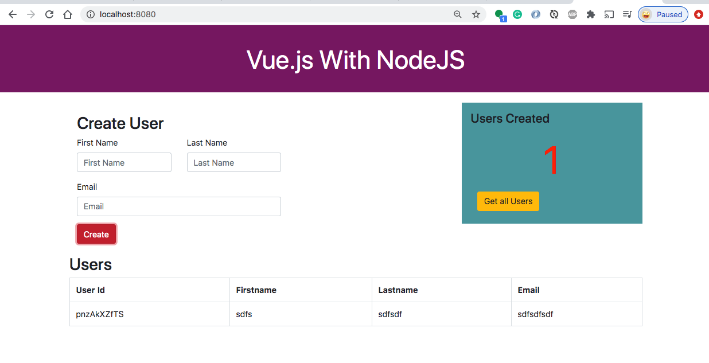

# Vue.js — How To Proxy To Backend Server
Example Project to demonstrate on how to proxy to backend server
___
There are so many ways we can develop and deploy the Vue application. Mostly we are deploying Vue applications in serverless mode nowadays. We can store all the Vue assets or build in the S3 bucket for the static web hosting and call the API calls with CORS enabled. You can even use Azure static web app service to host the Vue application with Azure functions as a backend service.
Whatever the deployment method we use we have to use proxy in the development environment. We often talk to backend servers in the development phase. In this post, we will see how we can proxy to the backend API in the development environment.
## What is proxying
In general, A proxy or proxy server serves as a gateway between your app and the internet. It’s an intermediate server between client and servers by forwarding client requests to resources.

In Vue, we often use this proxying in the development environment. Vue uses a Vue CLI Service (webpack dev server) to serve the app in development mode. If we look at the following diagram, app UI is running on port **8080**, and the backend server is running on port **3080**. All the calls start with **/api** will be redirected to the backend server and the rest all fall back to the same port.

In subsequent sections, we will see how we can accomplish this and other options as well.

 
<div style="text-align: center;"><b>proxying all URLs start with /api</b></div>

## Example Project
Here is an example project with the Github link you can clone it and try it on your machine.

<pre><code>// clone the project
git clone https://github.com/bbachi/vuejs-proxy-example.git

// Run the API
cd api
npm install
npm run dev

// Run the Vue UI
cd my-app
npm install
npm run serve</code></pre>

Once you install all the dependencies, you can start both the Vue app and node js server on **8080** and **3080** respectively.
You can start the Vue app with these commands npm run serveor vue-cli-serve serveand here is the Vue app running on **8080**.



<div style="text-align: center;"><b>Vue UI running on port 8080</b></div>
Let’s start the server with this command `npm run dev` and test this API on port **3080**.


<div style="text-align: center;"><b>API running on the port 3080</b></div>

## Proxy Setup Options
Here are some of the options for the proxy setup
- **target**: This is where we need to define the backend URL.
- **pathRewrite**: We need to use this option to edit or rewrite the path
- **changeOrigin**: If your backend API is not running on the localhost, we need to make this flag true.
- **logLevel**: If you want to check whether proxy configuration working properly or not, this flag should be debug.
- **bypass**: Sometimes we have to bypass the proxy, we can define a function with this. But it should define in proxy.config.js instead of proxy.config.json.

## Proxy Setup
Now app and server running on different ports. Let’s set up a proxy for communication between these.
The first thing you need is this **vue.config.js**. You need to place this file in the root location where package.json resides. We are defining the target for all the URLs starts with /api here.

 
```js
module.exports = {
    devServer: {
        proxy: {
            '^/api': {
                target: 'http://localhost:3080',
                changeOrigin: true
            },
        }
    }
}
```

Once this is placed in the appropriate place you don’t need to do anything else. All you need to run the API and the app on different terminals.

```sehll
// on Terminal 1
cd my-app
npm run serve

// on Terminal 2
cd api
npm run dev
```
Here is the App running on the port **8080** and all the API calls are proxying to the port **3080**.

<div style="text-align: center;"><b>App working with proxy</b></div>
If you change the port in the proxy value in the **vue.config.js** proxying calls to the API will not work. Vue CLI Service will throw the error as below.


<div style="text-align: center;"><b>Not able to proxy</b></div> 

## How To Proxy to Multiple APIs
We have seen how we can proxy into one API from your Vue.js UI. This is not the case most of the time. Your Vue.js app might need to call multiple APIs to get the data. Let’s see how we can do that.

For example, if you look at the below diagram the Vue.js UI is calling two APIs: **api** and **api2**. All the calls that start with **/api** should be redirected to **User API** and all the calls that start with the **/api2** should be redirected to **User API2**.

<div style="text-align: center;"><b>proxy for multiple APIs</b></div> 
We can implement this scenario with the **vue.config.js**. I have added one more API with the context path api2 and we need to add one more middleware entry as shown in the **vue.config.js** file.


<div style="text-align: center;"><b>another api called api2 added</b></div> 

```js
module.exports = {
    devServer: {
        proxy: {
            '/api': {
                target: 'http://localhost:3080/'
            },
            "/userapi": {
                target: 'http://localhost:3070/',
                pathRewrite: {'^/userapi': '/api2'}
            }
        }
    }
}
```

In the api2 API we have the same functionality but running on a different port **3070**. Here is the server.js file from api2.
```js
const express = require('express');
const path = require('path');
const app = express(),
      bodyParser = require("body-parser");
      port = 3070;

// place holder for the data
const users = [{
  firstName: "from API v2",
  lastName: "from API v2",
  email: "from API v2"
  }];

app.use(bodyParser.json());
app.use(express.static(path.join(__dirname, '../my-app/build')));

app.get('/api2/users', (req, res) => {
  console.log('api/users called!')
  res.json(users);
});

app.post('/api2/user', (req, res) => {
  const user = req.body.user;
  console.log('Adding user:::::', user);
  users.push(user);
  res.json("user addedd");
});

app.get('/', (req,res) => {
  res.send(`<h1>API Running on the port ${port}</h1>`);
});

app.listen(port, () => {
    console.log(`Server listening on the port::${port}`);
});
```
Let’s test these two APIs from the Vue application port **8080**.


<div style="text-align: center;"><b>We can proxy to multiple endpoints</b></div> 

## Rewrite the Path URL
Whenever there is a change in the URLs, we often rewrite the path of the backend server endpoints. We can do that with the `pathRewrite`.
Let’s understand the **`pathRewrite`** option. For instance, our backend URL /api/users is changed to /api/some/users and we want to test in development before it goes to production. We can achieve this with the option pathRewrite like below.

```js
module.exports = {
  devServer: {
    proxy: {
      '^/api': {
        target: 'http://localhost:3080',
        changeOrigin: true,
        pathRewrite: {
          '^/api': '/api/some/'
        },
      }
    }
  }
}
```

## Multiple app entries to one API endpoint
Sometimes we have multiple modules with services in our app. We might have a scenario where multiple entries or services will call the same API endpoint.
For example, we have two paths that are needed to be redirected to the same endpoint. This is possible with the following setup.

```js
module.exports = {
  devServer: {
    proxy: {
      '/api': {
        target: 'http://localhost:3080/'
      },
      "/userapi": {
        target: 'http://localhost:3080/',
        pathRewrite: {'^/userapi' : '/api'}
      }
    }
  }
}
```
Now if you hit both URLs in the browser **http://localhost:8080/api/users** and **http://localhost:8080/userapi/users** both will be redirected to the same API.

<div style="text-align: center;"><b>Multiple app entries to one API endpoint</b></div> 


## Summary
- In Vue.js, the config file **vue.config.js** is used mostly in the development environment to facilitate the communication between server and UI.
- We need to have a backend server and UI running on different ports.
- The proxy entry should be added to the vue.config.js file which resides in the root location where package.json resides.
- We need to make sure the Vue App and Backends are running on different ports for successful communication.
- We don’t need to install any third party library for proxying
- We can rewrite the path with the option pathRewrite.
- We can proxy multiple entries to one backend API with it as well.
- We can proxy multiple entries to multiple backends as well with multiple entries in the middleware.

## Conclusion
This is a really good feature for the development phase. If you are working on the Vue application this feature really speeds up your development.
